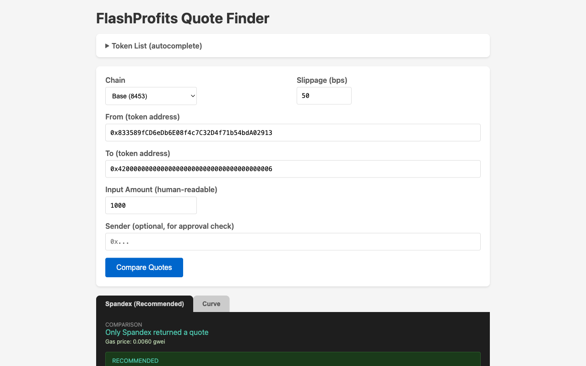

> **WARNING: This is a vibe coded prototype. Use at your own risk.**

# compare-dex-routers

A DEX router comparison tool that queries multiple swap routers ([Spandex](https://www.spandex.exchange/) and Curve Finance) and returns quotes from each. Compare pricing, routes, and gas estimates side-by-side. Includes a built-in web UI for testing quotes interactively.



## Supported Chains

| Chain     | ID    |
| --------- | ----- |
| Ethereum  | 1     |
| Base      | 8453  |
| Arbitrum  | 42161 |
| Optimism  | 10    |
| Polygon   | 137   |
| BSC       | 56    |
| Avalanche | 43114 |

## API

### `GET /compare`

Compare quotes from multiple routers (Spandex and Curve) side-by-side.

| Param        | Required | Description                                |
| ------------ | -------- | ------------------------------------------ |
| `chainId`    | yes      | Chain ID (see table above)                 |
| `from`       | yes      | Input token address                        |
| `to`         | yes      | Output token address                       |
| `amount`     | yes      | Human-readable input amount (e.g. `1000`)  |
| `slippageBps`| no       | Slippage tolerance in basis points (default `50`) |
| `sender`     | no       | Sender address for approval checks         |

### `GET /quote`

Returns a quote from the Spandex router (aggregates across 0x, Fabric, KyberSwap, Odos, LiFi, Relay, Velora).

Same parameters as `/compare`.

### `GET /chains`

Returns the list of supported chains.

### `GET /health`

Health check endpoint.

### `GET /`

Interactive web UI for comparing quotes.

## Prerequisites

- Node.js >= 20
- An [Alchemy](https://www.alchemy.com/) API key (or per-chain RPC URL overrides)

## Setup

```sh
cp env.example .env
```

Edit `.env` and fill in your keys:

```
PORT=3000
HOST=0.0.0.0
APP_ID=flashprofits
ALCHEMY_API_KEY=your_key_here
```

Optional environment variables:

| Variable          | Description                                  |
| ----------------- | -------------------------------------------- |
| `ZEROX_API_KEY`   | 0x API key for the 0x provider               |
| `FABRIC_API_KEY`  | Fabric API key                               |
| `RPC_URL_<id>`    | Per-chain RPC override (e.g. `RPC_URL_8453`) |

Install dependencies:

```sh
npm install
```

## Development

Start the server with file watching:

```sh
npm run dev
```

The server starts at `http://localhost:3000` by default. Open it in a browser to use the quote UI.

### Other Commands

```sh
npm run typecheck       # Type-check without emitting
npm run lint            # Lint with ESLint
npm run lint:fix        # Lint and auto-fix
npm run format          # Format with Prettier
npm run format:check    # Check formatting
npm test                # Run tests
npm run test:watch      # Run tests in watch mode
npm run test:coverage   # Run tests with coverage
```

## Production

### Direct

```sh
npm start
```

### Docker

Build and run with Docker Compose:

```sh
docker compose up --build -d
```

This builds the image, installs production dependencies only, and starts the server on port 3000 (configurable via `PORT` in `.env`).

To stop:

```sh
docker compose down
```
